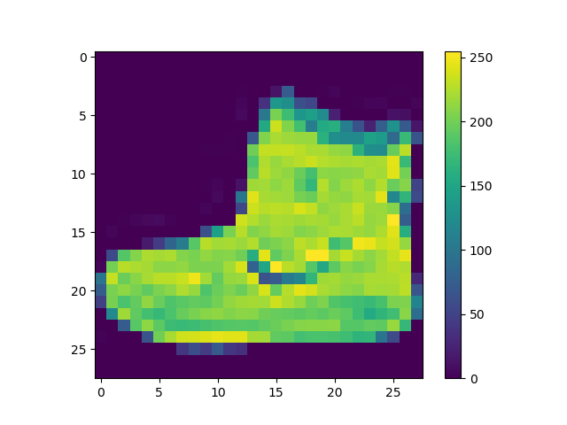
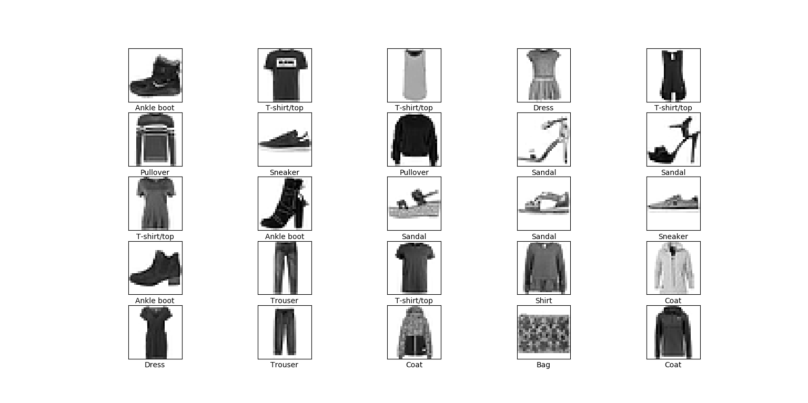
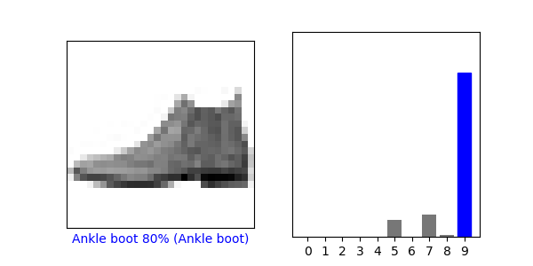
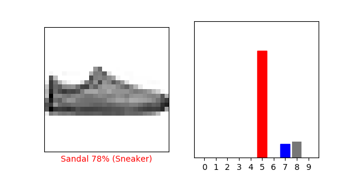
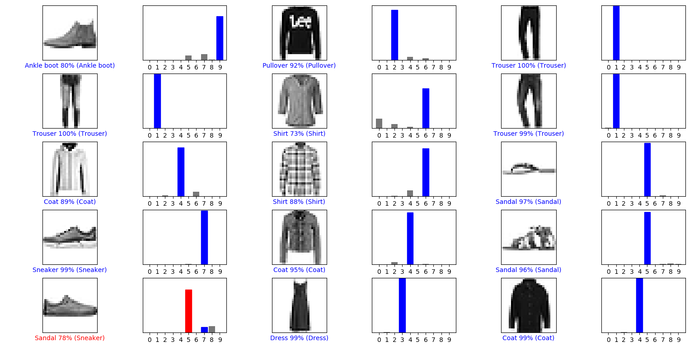

# nn-cnn-fashion-mnist
This is a sample test code for keras fashion-mnist data set

### Sample images of DataSet  

  

  

### Training DataSet

  

### Result after training for Ankle boot

  

### Result after training for Sneaker

  

### Result for all the test images

  

